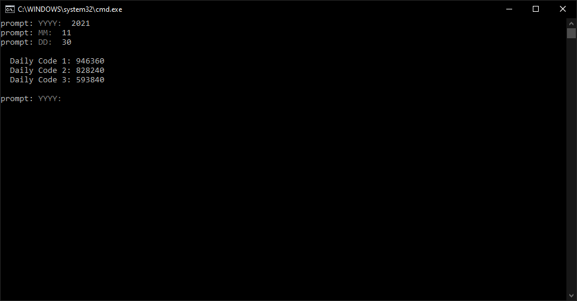

# cotd

## Description

This script will generate 3 daily codes for legacy Dahua products from the command line interface. You will need to try each code until you find the one that lets you in. These codes will only work on machines 2017 and older.

## Table of Contents

- [Prerequisites](#prerequisites)
- [Installation](#installation)
- [Usage](#usage)
- [Credits](#credits)
- [Inquiries](#inquiries)

## Prerequisites

1. Node.js will need to be installed and configured

## Installation

1. Clone the repository
2. Navigate to the folder and launch a command prompt
3. Run npm -i to install required packages
4. Modify cotd-batch.bat file to the location where the script is saved

## Usage

Launching the batch file will immediately prompt you to enter a year in YY format, e.g. 21 for year 2021. After inputting the year, you'll need to input the 2-digit month and day afterwards. Make sure you're inputting only 2 digits as there's no logic to check if your input is correct.

Once the codes are generated, you can attempt to login to the machine. It's important to note you can only use these with a display and mouse connected to the recorder. You cannot use a computer. You can use the same code that lets you in to reset the password by filling out the old password field.

## Credits

http://github.com/mondrovic

## Inquiries

Any questions or inquiries can go to mondrovic1@gmail.com
Matthew Ondrovic
https://githbub.com/mondrovic
